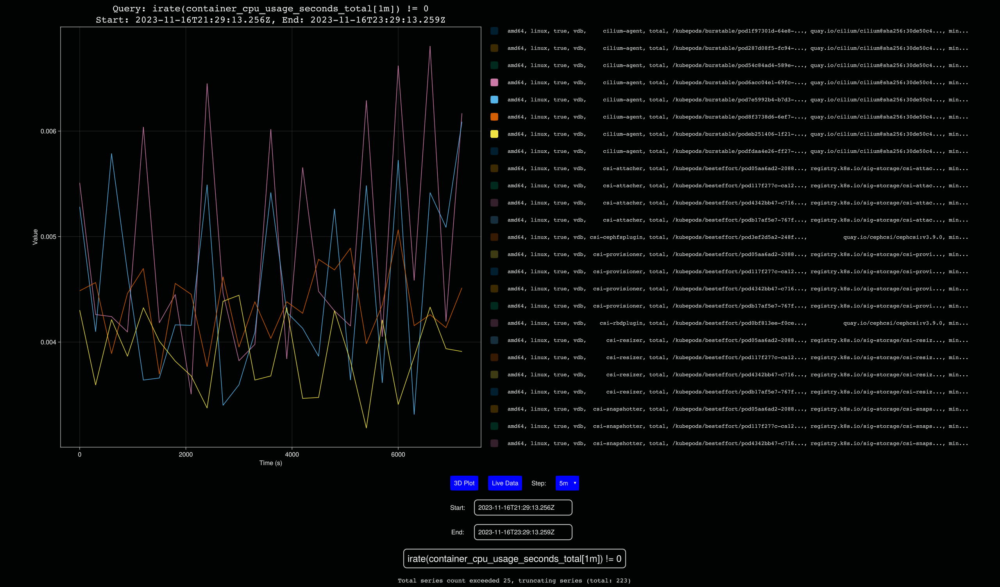
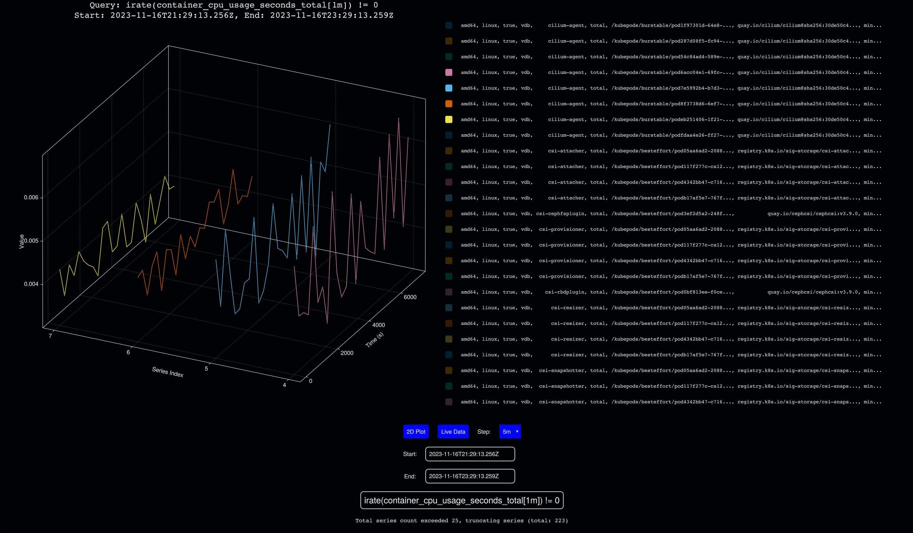

# PromPlot
Plot Prometheus graphs in the command line or in a GUI with [`Makie.jl`](https://github.com/MakieOrg/Makie.jl)





# Getting started
TODO, but some instructions on getting a local dev environment setup are as follows:

Eventually, I want to make this installable via `krew` so that it can be used as a `kubectl` plugin.

### Quick Start
1. `julia`
2. `]activate .`
3. `]instantiate`
4. `julia --project=. PromPlot.jl --promql "idelta((sum by (method, path) (kubelet_http_requests_duration_seconds_sum))[24h:])" --url "http://prometheus.my-cluster.k8s.internal:9090`
5. Replace the `--url` argument with your Prometheus server

### Available options:
```
usage: PromPlot.jl [--promql PROMQL] [--gui GUI] [--tui TUI]
                   [--limit LIMIT] [--url URL] [--is3d IS3D]
                   [--start START] [--end END] [-h]

optional arguments:
  --promql PROMQL  Prometheus PromQL Query (required)
  --gui GUI        Plot in GUI - Required for 3D Mode (default: true)
  --tui TUI        Plot in CLI/TUI (default: false)
  --limit LIMIT    Maximum number of series to plot (type: Int64, default: 25)
  --url URL        Prometheus URL (default: "http://localhost:9090")
  --is3d IS3D      Start in 3D Plotting Mode (default: false)
  --start START    Query Start Date (default = now(UTC) - 2h)
  --end END        Query End Date (default = now(UTC))
  -h, --help       show this help message and exit
```